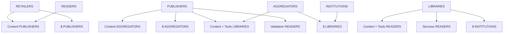

# The Scholarly Publishing Cycle

Having explored the scholarly publishing ecosystem and its primary relationships, we can update the cycle as follows:

Our project set out to explore and address the shortfall in serving the scholarly reader identified in this section. This shortfall is made clear in two connected points:

- Scholarly readers are not just content consumers; scholarly reading is an act of creation as well.
- Publishers and aggregators are not incentivized to create better tools to support scholarly reading.

From here, this report will consider the experiences of publishers, librarians and readers through a synthesis of interviews conducted with several members of each group, as well as a short online survey aimed at readers. We will then share some of our own philosophy on the future of scholarly reading, then detail the path forward we see for our own work in the area.

10 | The Scholarly Publishing Ecosystem